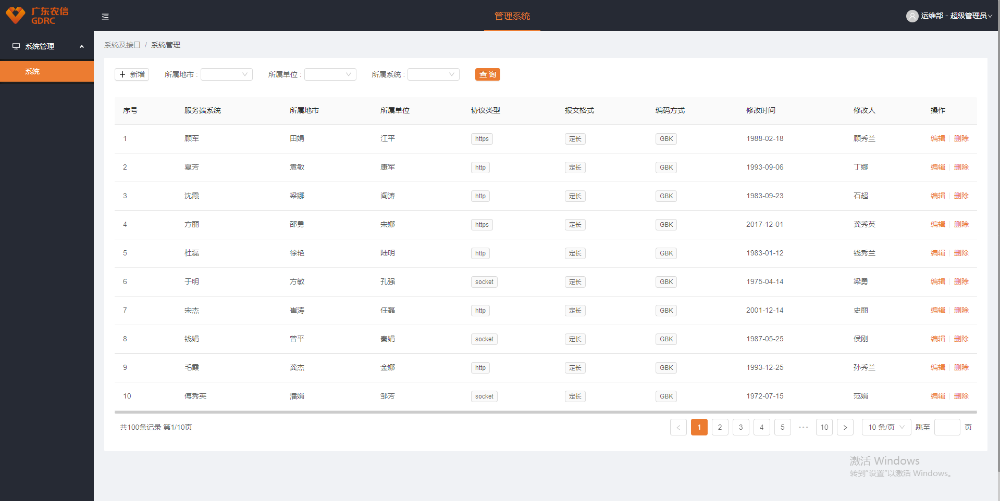
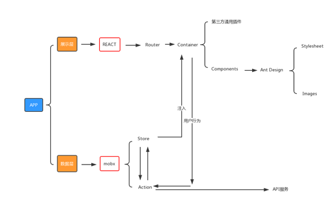

<!--
 * @Author: your name
 * @Date: 2019-10-31 10:26:54
 * @LastEditTime: 2019-10-31 11:55:37
 * @LastEditors: Please set LastEditors
 * @Description: In User Settings Edit
 * @FilePath: \react-framework\README.md
 -->

## react-framework
- 基于react、ant-Design构建开发，实现后台管理前端功能，提供一套更优的前端解决方案
- 全程面向对象编程，技术栈有react、react-router、webpack、eslint、less、mobx及其store的灵活继承、模块化、组件化、react高阶组件HOC、环境变量控制api访问的地址、layer的loading
- 前后端分离，通过token进行数据交互，可独立部署
- 动态菜单，通过菜单管理统一管理访问路由
- 数据切换，通过mock配置对接口数据／mock模拟数据进行切换

#### 截图实例

#### 架构图

## Quick Start
#### Down
~~~
git clone https://github.com/TsangTszKin/react-mobx-framework.git
~~~

#### Install
~~~
npm install
~~~

#### Dll
第一次运行需要打包vendor，仅运行一次。当依赖改变时需重新打包。
~~~
npm run dll
~~~

#### Run
~~~
npm start
~~~

#### Build
~~~
npm run build
~~~

#### 发布CDN(推荐)

将project.config.js内publicPath改为服务器绝对路径。

#### 发布静态资源

若没有CDN，只能发布静态资源，需修改webpack配置，将所有文件放置在同一目录下。

